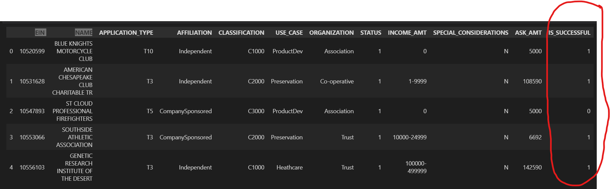
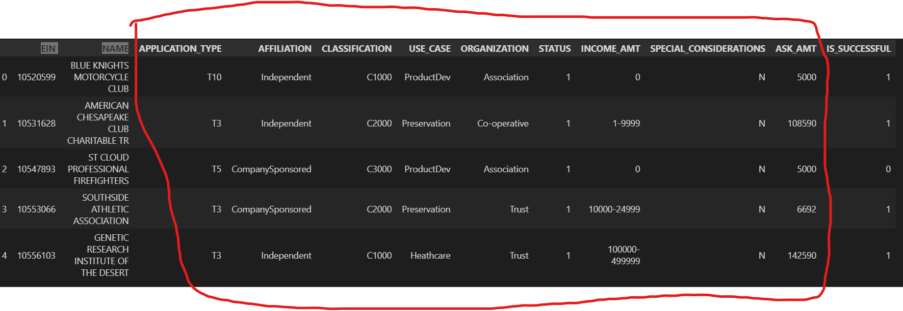
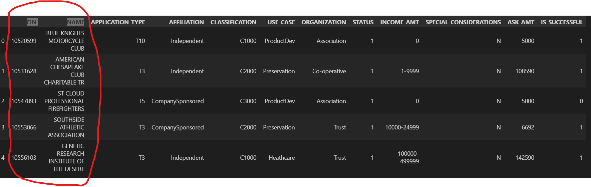
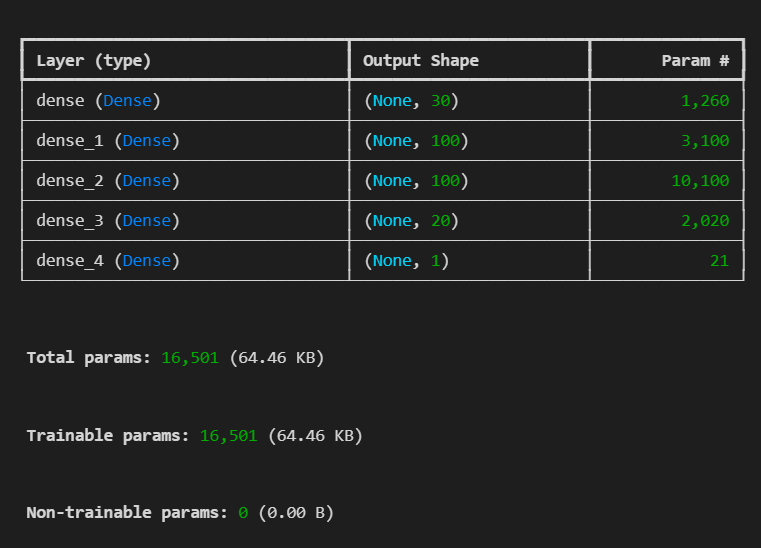

# Overview of the analysis: Explain the purpose of this analysis.

In this practice, deep learning model from tensorflow is used to study the data of over 34000 organizations that have received funding from Alphabet Soup. The purpose of the analysis is to train the neural network model to learn the features and labels in the dataset, so it can predict if a candidate would be successful or not in the future. 

# Data Preprocessing

* What variable(s) are the target(s) for your model?

The column "IS_SUCCESSFUL" is the target variable the model is trying to predict.

* What variable(s) are the features for your model?

"APPLICATION_TYPE", "AFFILIATION",	"CLASSIFICATION", "USE_CASE", "ORGANIZATION", "STATUS", "INCOME_AMT", "SPECIAL_CONSIDERATIONS", "ASK_AMT" are the features that will be trained by the model. These features will get processed by one hot encoder before split and train.

* What variable(s) should be removed from the input data because they are neither targets nor features?

"EIN" and "NAME" columns are removed from the database.

# Compiling, Training, and Evaluating the Model

* How many neurons, layers, and activation functions did you select for your neural network model, and why?

In the final optimized version, the best performing model has 30 neurons in the input layers, 100, 100, and 20 neurons in the hiden layers accordingly, and 1 neuron in the output layer. I have used tuner from tensorflow to run loops on validation dataset to try different activation functions, layers, neurons. In the end, the above hyperparameters have done the best perfmance. So they are chosen, as shown in the pic.

* Were you able to achieve the target model performance?

Yes, the model achieved 1.0 accuracy and 2.9549e-05 loss. It is way too accurate. 

* What steps did you take in your attempts to increase model performance?

1. Reduce the unique values in columns of "APPLICATION_TYPE", "AFFILIATION", "CLASSIFICATION", so the the dimensions of this dataset is greatly reduced after getting through one hot encoder.

2. Seperate the dataset into three parts, 60% for training, 20% for validation, 20% for testing.

3. Apply the tuner function to find the best hyperparameters of the model on training dataset.

# Summary: Summarise the overall results of the deep learning model. Include a recommendation for how a different model could solve this classification problem, and then explain your recommendation.

Overall, the results are too good. Since the output layer is a sigmoid function, which should return a accuracy number that is as close to 1 as possible, but it eventually returned a 1. That suggests that the dataset might be too simple or I should undone some of the preprocessing steps to make it more challenging for the machine. 

Logistic Regression and Support Vector machines are recommended, because they are great at solving binary classification problem. Logistic Regression return a probability of the label just like the sigmoid fuction did in the ouput layer. And SVM uses a different method which constructs a hyperplace in a high dimensional space to seperate the classes by a certain benchmark score. 